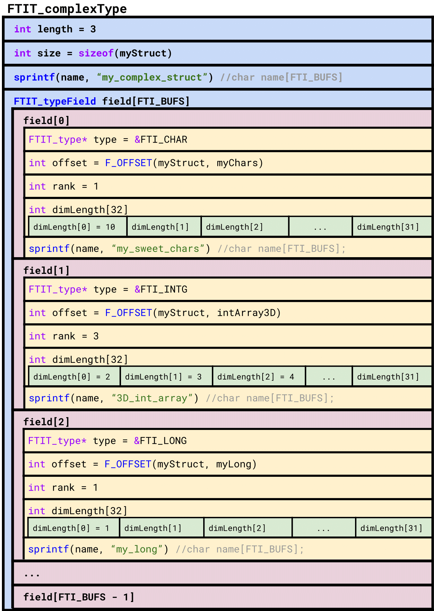

.. Fault Tolerance Library documentation FTIFF file
.. _ftiff:

FTI File Format
==========================

FTI-FF Structure
--------------------------

The file format basic structure, consists of a meta block and a data block:

.. code-block::

   +--------------+ +------------------------+
   |              | |                        |
   | FB           | | VB                     |
   |              | |                        |
   +--------------+ +------------------------+

..

   The ``FB`` (file block) holds meta data related to the file whereas the ``VB`` (variable block) holds meta and actual data of the variables protected by FTI.

..

	The ``FB`` has the following structure:

.. code-block::

	FB {
		checksum         // Hash of the VDB block in hex representation (33 bytes) 
		hash             // Hash of FB without 'hash' in unsigned char (16 bytes) 
		ckptSize         // Size of actual data stored in file
		fs               // Size of FB + VB
		maxFs            // Maximum size of FB + VB in group
		ptFs             // Size of FB + VB of partner process
		timestamp        // Time in ns of FB block creation
	}
..

	The ``VB`` block possesses the following sub structure:

.. code-block::

   |<-------------------------------------------------- VB -------------------------------------------------->|
   #                                                                                                          #
   |<------------- VCB_1 --------------------------->|      |<------------- VCB_1 --------------------------->|
   #                                                 #      #                                                 #       
   +-------------------------------------------------+      +-------------------------------------------------+
   | +--------++-------------+      +--------------+ |      | +--------++-------------+      +--------------+ |
   | |        ||             |      |              | |      | |        ||             |      |              | |
   | | VMB_1  || VC_11       | ---- | VC_1k        | | ---- | | VMB_n  || VC_n1       | ---- | VC_nl        | |
   | |        ||             |      |              | |      | |        ||             |      |              | |
   | +--------++-------------+      +--------------+ |      | +--------++-------------+      +--------------+ |
   +-------------------------------------------------+      +-------------------------------------------------+

.. 

	Where the ``VMB_i`` (variable meta data block) hold meta data related to the data chunk stored in ``VDB_ij`` (variable chunk). The number of data chunks (e.g. ``k`` and ``l`` in the scetch), generally may differ. We refer to the set ``VMB_i``, ``VC_i1``, ..., ``VC_ik`` as ``VCB_i`` (variable chunk block).

	The ``VMB_i`` have the following sub structure:

.. code-block::

   |<-------------- VMB_i ------------->|
   #                                    #
   +-------++---------+      +----------+
   |       ||         |      |          |
   | BMD_i || VMD_i1  | ---- | VMD_ij   |
   |       ||         |      |          |
   +-------++---------+      +----------+

..

	Where the ``BMD_i`` (block meta data) have the following structure:

.. code-block::

   BMD_i {
       numvars          // Number of variable chunks in data block 
       dbsize           // Size of entire block VCB_i (meta + actual data)
   }

..

	The ``VMD_ij`` have the following structure:

.. code-block::

   VMD_ij {
       id               // Id of protected variable the data chunk belongs to
       idx              // Index of element in FTI_Data corresponding to protected variable with id='id'
       containerid      // Id of container variable chunk is stored in
       hascontent       // Boolean value indicating if container holds data or not
       dptr             // Position of chunk in runtime-data (FTI_Data[idx].ptr + dptr)
       fptr             // Position of chunk in file
       chunksize        // Size of chunk stored in container
       containersize    // Total space in container
       hash             // Hash of 'VC_ij'
   }

FTI-FF Diagram
--------------------------
