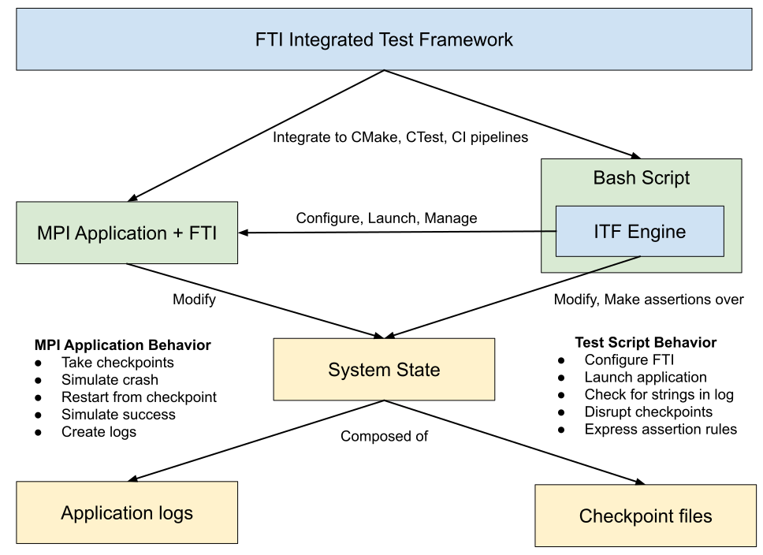
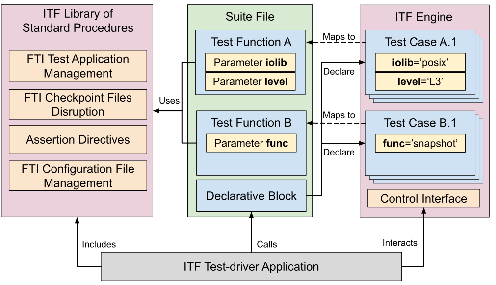

.. Fault Tolerance Library documentation ITF file

FTI Integrated Tests Framework (FTI-ITF)
===================================================

The FTI Integrated Test Framework (ITF) is a tool to develop black-box bash scripts to test FTI.
ITF defines a standard procedure to develop FTI tests and allows a common design for FTI test cases.
Given its nature, FTI tests interfaces with the operating system (e.g. to kill processes, delete, and corrupt files).
ITF serves the purpose of abstracting these common operations into bash functions within a test engine.

ITF is the result of a refactoring effort to standardize FTI test scripts authored by multiple developers.
As the original tests, the framework and its test cases are written in bash.
ITF provides simple assertion features as in libraries like CUnit, JUnit, google test, and others.
Moreover, ITF also contains FTI-specific functions to assist with configuration and checkpoint file manipulation.

This guide documents how to use ITF as well as how to develop and debug FTI test cases.
The discussion is organized in a multi-level hierarchy of topics as follows:
(i) FTI Test Design;
(ii) User Guide;
(iii) Test Developer Guide and
(iv) ITF Internals.
Topics 1 and 2 are recommended to any FTI contributor as to execute existing FTI tests.
Topic 3 is recommended for FTI contributors working on new tests.
Finally, topic 4 details and documents the ITF engine implementation.
The latter is recommended for DevOps looking to enhance FTI integration and development pipelines.

FTI Test Design
-----------------

FTI is a fault tolerance checkpointing library for distributed-memory applications.
The library is used on MPI applications tailored to execute in high-performance environments.
However, for testing purposes, application-specific computations can be ignored for the most part.
Instead, FTI tests must guarantee the correct **interactions** among application, library, and system.

FTI uses black-box tests as the testing model to validate its features.
In this model, FTI internal workings are abstracted.
The tests focus on validating the system state between calls to an FTI-enhanced application.
To implement this model, two major components are required, a **test application** and a **test script**.
The **test application** is a software developed in C/C++, or Fortran, using FTI.
The **test script** verifies the system state as well as set up and launch the test application.

Overview of Design Rules
~~~~~~~~~~~~~~~~~

FTI test applications are not yet subject to strict ruleset on how to be developed.
However, each application must portray one target FTI feature to be tested under different configurations.
On the other hand, the contents of test scripts follow the guidelines implemented by ITF.
Among ITF goals, the framework attempts to reduce code duplication.
Hence, ITF contains a library of standard procedures used when testing FTI used to:
(i) register a test case;
(ii) manage and launch MPI applications;
(iii) manage FTI configuration files;
(iv) disrupt FTI checkpoint files and
(v) express assertions (i.e conditional and unconditional commands to pass/fail a test);
The ITF standards are encapsulated in a software piece called **ITF engine**.
Adhering to these standards creates a straightforward integration to CMake and continuous integration (CI) pipelines.
An overview of the FTI test design is displayed in the Figure below.

Detailed Design Rules
~~~~~~~~~~~~~~~~~

ITF test scripts are also referred to as **ITF suite files**, or simply **suite files**.
These scripts must, by convention, test a single FTI feature for better code quality.
Each suite file contains one or more **test functions** and have the *.itf* filename extension.
These test functions are bash equivalents of **parameterized test cases**.
In other words, functions with a fixed behavior that generate unique test cases when subject to different *parameters*.
In summary, **suite files** declare **test cases** by defining sets of *parameter values* for **test functions**.

Suite files are not meant to be executed directly from the terminal despite being bash scripts.
They are similar to a library of test functions.
Besides, they also contain a *declarative block* of bash code to register test cases.
Ultimately, suite files depend on ITF code to execute and must be linked to its source.

A program called ITF test-driver puts every piece together so that tests can be executed.
It creates a sandbox for each test case by orchestrating code from the ITF, its modules, and the suite file.
In summary, the test-driver includes ITF modules and engine sources.
Then, it calls the *declarative block* from the suite files and populates the engine with test cases.
Next, it interacts with the *control interface* in the engine to execute the tests.
Finally, the test-driver listens to engine events and collects the test results.
A summary of these interactions is depicted in the Figure below.

ITF User guide
-----------------

This section teaches FTI contributors to utilize the ITF test-driver program.
The goal is that, by the end of the section, new contributors can:
(i) execute the existing FTI test cases;
(ii) cherry-pick test cases for execution from suites and
(iii) filter out tests.

Executing FTI tests cases: ITF test-driver
~~~~~~~~~~~~~~~~~

ITF test-driver application is found in *build_dir/testing/itf/testdriver* after building FTI.
The program has a *--help* argument to display all of its options and configurations.
Its mandatory arguments are the paths to ITF suite files that contain the test cases to be executed.
By convention, ITF suite files are located in the *build_dir/testing/suites* subdirectories.
As an example, it is possible to execute the test cases for the **recoverVar** feature with the following script.

.. code-block:: bash
   cd path/to/build_dir/testing
   itf/testdriver suites/features/recoverVar/recovervar.itf

ITF test-driver can also execute multiple suite files at once and display accumulated statistics.
The following command executes two suites, *recovervar* and *keepl4*.

.. code-block:: bash
   cd path/to/build_dir/testing
   itf/testdriver suites/features/recoverVar/recovervar.itf suites/features/keepL4Ckpt/keepl4.itf

The *testing/suites* directory is organized hierarchically.
Each subdirectory represents a collection of ITF suites.
The **compilation** collection is for tests targeting the compilation process of FTI.
The **core** collection is for the main FTI features (i.e multi-level checkpointing).
Finally, the **features** collection is for the additional FTI features.
This organization allows for the use of Unix tools to execute groups of related tests.
For instance, the following command is used to run the *core* suite collection.

.. code-block:: bash
   cd path/to/build_dir/testing
   itf/testdriver $(find suites/core -iname *.itf)

Executing FTI tests cases: CTest
~~~~~~~~~~~~~~~~~

FTI uses CMake as the build manager for the library and its additional resources.
CMake contains a tool, CTest, used to define tests to different CMake targets.
As such, FTI tests can also be executed using the CMake *ctest* command.
Suite files are populated with labels so that the *ctest* command is more appealing for users.
For instance, the following command will execute all ITF suites in the *suites/core* folder.

.. code-block:: bash
   cd path/to/build_dir
   ctest -V -L core

The *-V* argument configures CTest to print the test-driver output to the terminal.
By default, CTest suppresses all output from underlying commands.
The *-L* argument limits the execution to tests that contains the **core** label.
To check out all labels existing in FTI, use the *ctest --print-labels* command.
As of now, there are individual tags for each suite plus the **core** and **features** for both suite collections.

CTest calls ITF test-driver program with pre-defined attributes under the hood.
However, it also has its own set of features.
For instance, the *--rerun-failed* argument will re-execute ITF suites that failed in a previous execution.
This kind of functionality is out of the scope for the ITF test-driver due to its stateless design.
Ultimately, we recommend using the test-driver for configuration flexibility and CTest for complete project validation.

Filtering test cases
~~~~~~~~~~~~~~~~~

An important part of debugging a program is reproducing the problem.
However, by default, the test-driver executes all **test cases** in a given **suite file**.
Imagine that a bug is found in a trait present only in a single **test function**.
For instance, consider the *dCP* suite.
It tests the differential checkpoint feature and contains two **test functions**:
(i) *standard* and
(ii) *corrupt_check*.
Imagine now that a bug manifests only in the *corrupt_check* function.
It is possible to invoke only this test function by using the following command.

.. code-block:: bash
   cd path/to/build_dir/testing
   itf/testdriver suites/features/differentialCkpt/dCP.itf --pick dCP:corrupt_check --verbose 

The *--verbose* is optional and is used to see the application output as the **test cases** progress.
The *--pick* argument for the test-driver program restricts the functions to be executed to the one supplied in the *format*.
Moreover, the format, *suite_name:function_name*, is common to all filtering functions in ITF:
(i) *suite_name* is the **suite file** name without the suffix and
(ii) *function_name* is the test function name.
In the previous example, the test-driver ignores all functions save for *corrupt_check*.

The *--pick* option can be passed multiple times to the test-driver.
Each new instance appends the *format* to a list of allowed **test functions**.
In other words, function names must be in at least one of the supplied formats to be executed.
This behavior remains when the test-driver is processing multiple suites at once.
For instance, both dCP and recovervar suites have test functions named *standard*.
If we desire to run both standard functions but ignore *corrupt_check*, the following command must be used.

.. code-block:: bash
   cd path/to/build_dir/testing
   
   dcp=suites/features/differentialCkpt/dCP.itf
   recovervar=suites/features/recoverVar/recovervar.itf

   itf/testdriver $dcp $recovervar --pick dCP:standard --pick recovervar:standard

ITF also allows filtering out test functions in addition to cherry-picking by name.
This function manifests as the *--ignore* option.
Keep in mind that it is not possible to use both *--pick* and *--ignore* simultaneously.
It is possible to rewrite the previous example using *--ignore* instead with the following commands.

.. code-block:: bash
   cd path/to/build_dir/testing
   
   dcp=suites/features/differentialCkpt/dCP.itf
   recovervar=suites/features/recoverVar/recovervar.itf

   itf/testdriver $dcp $recovervar --ignore dCP:corrupt_check

Sometimes it is interesting to execute only one or a few **test cases** from a **test function** (i.e hunting a bug related to an IO library).
In this case, these functions are available under the *--filter* and *--revfilter* options.
The *filter* option is used to ignore **test cases** when a given argument value matches at least one value from a supplied set.
The *revfilter* option is used to ignore **test cases** when a given argument value does not match any value from a supplied set.
Both commands extend the *filter format* definition resulted in *suite_name:function_name:argument_name=value[,value2]...*.
As an example, observe the following command using *--filter*.

.. code-block:: bash
   cd path/to/build_dir/testing
   
   recovervar=suites/features/recoverVar/recovervar.itf

   itf/testdriver $recovervar --filter recovervar:standard:iolib=1,2,3,4

The aforementioned command will execute the *recovervar* test suite.
The suite is composed of a single function, *standard*.
The *standard* test function has two parameters:
(i) iolib and
(ii) level.
The *--filter* option signals the test-driver to ignore all test cases where the *iolib* parameter is assigned the values 1, 2, 3, or 4.

The *--revfilter* option works similarly, but it ignores test cases that **do not match** any of the values.
It is possible to achieve the same results with both commands.
For instance, we know that *recovervar:standard* contains test cases for iolib ranging from 1 through 5.
Given the objective of executing test cases where iolib is 5, the following command can be used.

.. code-block:: bash
   cd path/to/build_dir/testing
   
   recovervar=suites/features/recoverVar/recovervar.itf

   itf/testdriver $recovervar --revfilter recovervar:standard:iolib=5

The filtering options for test cases can also be used multiple times in the same command.
When applied to the same function, the filters are combined additively.
That is, the conditions are added atop of each other.
For instance, observe the following command.

.. code-block:: bash
   cd path/to/build_dir/testing
   
   recovervar=suites/features/recoverVar/recovervar.itf

   itf/testdriver $recovervar --revfilter recovervar:standard:iolib=5 --revfilter recovervar:standard:level=1

The aforementioned filter will evaluate into a single test case being executed.
That is, the *recovervar:standard* test case where *iolib* is 5 and *level* is 1.

The test-driver allows most filters to be combined.
They have an order of precedence when being evaluated in the engine.
First, the function-level filters are evaluated (i.e *--pick* or *--ignore*).
Then, the *--revfilter* filter is applied, if present.
Finally, the *--filter** option is evaluated, again, if present.
Together, these options give the user complete control of which test cases are to be executed.

Test Developer Guide
-----------------

The development of new tests stems from the creation of new features.
A feature without full coverage can also be the reason behind a new test.
Before developing the test, it is necessary to evaluate what needs to be tested.
If the object of testing is a new feature, a whole new **suite file** is needed.
Instead, if the object is another trait for an existing feature, a **test function** is needed.
Sometimes, it is just necessary to accommodate another use case, which frequently fits in a new **test case** for an existing test.
This section is dedicated to documenting the process of constructing a new suite file from scratch.

The public and private API regarding ITF functions are documented in-source.
ITF source is scattered in different files, each containing its own set of functions.
The core functionalities are found in *testing/tools/itf/src* while FTI-specific are located in *testing/tools/itf/modules*.
This guide goes through the most simple functions but readers are advised to look into more advanced features.

Assertions API
~~~~~~~~~~~~~~~~~

There is a collection of example suites that can be found in *testing/suites/examples*.
This suite collection is also installed in *build_dir/testing/suites/examples* if FTI is compiled with examples enabled.
These suite files will serve as examples for the remainder of this section.

The **assertions.itf** example suite file demonstrates the assertion API exposed by ITF.
The first two functions, *always_pass* and *always_fail* showcase unconditional assertion directives.
Indeed, the *pass* directive marks the test as passed while the *fail* directive will mark the test as failed.

Every ITF test function **may** branch out to an assertion directive.
If an assertion is not present at the last instruction, the test will be regarded as successful.
Moreover, unconditional directives will terminate the test regardless of the resolution.
This condition is not true for all conditional assertion directives.
Examples of conditional assertions can be observed in the *pass_if_zero*, *fail_if_zero* and *check_assertion* functions.

ITF conditional directives are divided into two categories:
(i) assertions and
(ii) checks.
Assertions will always finish the test regardless of the evaluation.
Checks, on the other hand, will only terminate the test if the check fails.
Besides, any directive that can cause the test to fail can be supplemented with an optional failure message.

All ITF assertions are implemented in the *testing/tools/itf/src/assertions* bash file.
The source code is documented and fairly short.
Nonetheless, a list of all available assertions and check functions is as follows.

**Unconditional directives**

* pass
   * Mark the test as passed and exit with 0;
* fail
   * Mark the test as failed and exit with 1;

**Conditional assertion directives**

* assert_equals
   * Evaluates two values and pass the test if both are equals, fail otherwise
* assert_not_equals
   * Same as assert_equals but pass the test if both values are different
* assert_files_exists
   * Pass the test if a given path represents a file, fail otherwise

**Conditional check directives**

* check_equals
   * Evaluates two values and fails the test if both are different
* check_not_equals
   * Evaluates two values and fails the test if both are equal
* check_is_zero
   * Fail the test if a given value is not zero
* check_non_zero
   * Fail the test if a given value is zero
* check_files_exists
   * Fail the test if a given path does not represent a file

Declaration Block API
~~~~~~~~~~~~~~~~~

The *declaration block* is a segment of Bash code to describe the suite file for the ITF engine.
For instance, it combines bash function names and a set of parameters to create **test cases**.
By convention, this segment of code is written at the end of the **suite file**.

The *ITF Declaration Block API* exposes commands to link bash names with actions in the ITF engine.
The most simple action is to register a test case.
This is done by using the *itf_case* command.
It takes the test function name and a set of parameters as arguments to form the **test case**.
For every call, ITF engine will register the function name as a **test function name**.
Besides, the parameters are stored in a list of **test cases** associated with that test function.

One important aspect of testing is to guarantee that tests do not affect the results of others.
This is usually done by creating a fixture, a pair of functions to execute before and after the test case.
Fixtures guarantee that the starting conditions are set before a test.
They also guarantee that everything created in the test case is destroyed before the next test.
For FTI, it usually comes down to unsetting bash variables and destroying files/directories.

ITF has support for the declaration of fixture functions for test cases in the *Declaration Block API*.
The *declaration_block.itf* example suite file showcases the use of this API.
In the test suite, three test variants are exposed to perform a simple check.
The behavior is to verify if a given string, passed by parameter, is present in a pattern file containing one entry per line.

The first test function in the **declaration_block** suite is *attempt_1*.
This code creates the file within the scope of the function, makes the check, and never disposes of the file.
The test cases for this function are registered in line 72 using the *itf_case* command.
The system state before and after the execution is not the same, hence this test function is ill-written.
The next attempt, *attempt_2*, uses *check* directives so that the test will not terminate on an assertion.
It clears the pattern files when the test succeeds.
However, the file is preserved if the test fails (i.e *check* directives terminate the test on failure).

The last attempt in the **declaration_block** suite, *attempt_3*, is a bit different.
It uses a **setup function**, namely *create_patterns*, to create the pattern file and set up a bash variable with its path.
The test is then executed normally.
After the test is executed, a **teardown function** is called, namely *delete_aptterns*, to unset the bash variable and remove the file.
These functions are registered per-function basis using the *itf_setup* and *itf_teardown* functions.
Moreover, these two functions can be combined in a single command, *itf_fixture*.
These commands associate a given **test function** to **fixture functions** that are called before and/or after each test case.
Ultimately, these functions support the sandbox created to isolate one test from another regardless of their status.

ITF provide another declaration block function, *itf_suite_unload*.
This command registers a function to be executed after **all test cases** for the suite has been executed.
It is used to keep the sandbox environment among suites when using the test-driver to run multiple suite files.
Use this function to unset variables, functions, and delete files created in the suite file outside the scope of the tests.
Keep in mind that ITF tracks and unsets the **test functions**, so clearing these names are not necessary.

Parameters API
~~~~~~~~~~~~~~~~~

ITF provides a *parameter API* to describe a function's required parameters.
It supports automatic parameter parsing, call validation, and bash variable creation procedures for **test functions**.
The API supports code readability by shadowing the Bash naming convention for function parameters (i.e $1, $2, $3).
Instead, it parses parameters out of order that follows the format: *--varname=value*.

The example suite **parameters.itf** showcase three different forms of validating parameters in **test functions**.
The first method, *no_validation* is subject to wrong test function invocations.
Line 23 attempts to register a test case without the second parameter, *password*.
As expected, this test case fails when performing the assertion as there is no value assigned to *password*.
The second test, *manual_validation* works as intended but adds extra behavior and complexity to the test.
Besides, after executing the tests, the bash variables *username* and *password* will continue to exist.

The last attempt, *automatic_validation* makes use of *ITF Parameters API* function *param_parse*.
This function enforces a standard on how to pass parameters to **test functions**.
As noted, in lines 54-58, parameters are passed to the function following the aforementioned standard format.
The **test function** redirect its parameters to *param_parse* using bash **$@** variable.
Also, it exposes variable names that must be informed for the test using the *+varname* notation.
In other words, line 47 states that the *automatic_validation* function requires the *username* and *password* variables assigned.

The *param_parse* command parses all arguments and automatically creates bash variables.
If a required argument is not found, the test automatically fails (i.e Line 58).
The test also fails if an argument is passed but not expected (i.e Line 56).
Besides, these variables are marked to be managed by ITF.
This means that they are automatically cleared after the execution of the test case, preventing them from leaking to other scripts.

FTI Module: Overview
~~~~~~~~~~~~~~~~~

ITF function library can be extended by linking modules using the *itf_load_module* command.
An **ITF module** is similar to a **suite file** in the sense that it contains functions and a *declarative block*.
However, instead of describing tests, the *declarative block* describes new ITF procedures and a method to unload them after processing the suite file.
Modules are loaded per-suite, so, if multiple test suite requires a set of functions from a module, each suite must issue a call to *itf_load_module*.
As of now, the only existing ITF module is called **FTI** and adds FTI common testing procedures.

The source code for ITF modules is located in *testing/tools/itf/modules*.
Currently, the modules are configured by CMake and installed at *build_dir/testing/itf/modules*.
ITF must be informed of the directory that holds its configured modules through an internal variable.
This variable can be set through the test-driver using the *--path-modules [DIR]* argument.
Moreover, the test-driver program located in FTI's build directory should have this argument correctly configured after compilation.

FTI module adds several procedures and bash variables to be used in **testing functions**.
They are divided into three main categories:
(i) FTI configuration file management API;
(ii) MPI application management API and
(iii) FTI checkpoint file query and disruption API.

FTI Module: Configuration File Management API
~~~~~~~~~~~~~~~~~

The example suite file **fti_cfg_api.itf** contains examples of how to use the FTI configuration file management API.
In a nutshell, this API contains functions and variables to query and modify values to an FTI configuration file.
When the FTI module is loaded, ITF creates a copy of an FTI configuration file with default settings for each test case in the suite.
The filename for this copy can be accessed through the ITF configuration variable, **itf_cfg**, which is a bash associative array.
To get the filename, query the *itf_cfg* variable for the key **fti:config**.
This procedure is showcased in the *print_cfg_file* test function within **fti_cfg_api.itf** suite file.

The base configuration file used for ITF to create copies is located at *testing/tools/itf/resources/fti_template.cfg*.
The copies can be modified during the test cases without affecting other tests.
To do so, it is possible to use the API function *fti_config_set*.
This function takes two parameters, the first in the field that will be modified and the second is the new value.
A complete list of functions for this API is listed below and usage examples are found in the **fti_cfg_api.itf** suite file.

* **fti_config_set** *field* *value*;
   * Set a field in the FTI configuration file;
* **fti_config_get** *field*;
   * Get the value of a field from the FTI configuration file;
* **fti_config_set_inline**;
   * Sets all checkpoint levels to inline (i.e inline_l[1,2,3]=1).
* **fti_config_set_noinline**;
   * Sets all checkpoint levels to be carried out in parallel (i.e inline_l[1,2,3]=0).
* **fti_config_set_ckpts** [l1] [l2] [l3] [l4];
   * Set the checkpoint interval for different checkpoint levels (all parameters are optional).
* **fti_config_dupe** *filename*
   * Creates a copy of the current FTI configuration file (the file is managed by the user).

FTI Module: MPI Application Management API
~~~~~~~~~~~~~~~~~

Another important procedure for testing FTI is launching MPI applications and parsing their logs.
The FTI module contains functions to assist developers with this task.
The list of functions for the MPI application management API, followed by a list of variables, is as follows.

**Functions**

* **fti_run** *app* [app arguments]...
   * Executes an MPI application with mpirun and stored its output in a temporary file.
* **fti_run_success** *app* [app arguments]...
   * Same as *fti_run* but will cause the test to fail if the application returns non-zero.
* **fti_check_in_log** *msg*
   * Checks is a message exists in the last application log, fails the test if it does not exist.
* **fti_check_not_in_log** *msg*
   * Same as *fti_check_in_log* but fails the test if the message **is present** in the log.
* **fti_assert_in_log** *msg*
   * Same as *fti_check_in_log* but also passes the test if the message does exist.
* **fti_assert_not_in_log** *msg*
   * Same as *fti_check_not_in_log* but also passes the test if the message does not exist.

**Variables**

All variables are keys contained in the *itf_cfg* associative bash array variable.
* **fti:app_stdout**
   * The full path to a file containing the stdout for the last application executed with *fti_run* or *fti_run_success*.
* **fti:nranks**
   * The rank count used to configure the mpirun command, resets to 16 every time the module is loaded.

The **mpi_api.itf** suite file contains examples for accessing and using these functions and variables.
Other variables about verbosity, checkpoint file directory configuration, and others also exist.
These were omitted for simplicity.
For a complete list, check the fti module source code located in *testing/tools/itf/modules/fti*.

FTI Module: Checkpoint file query and disruption API
~~~~~~~~~~~~~~~~~

The checkpoint file query and disruption API provides high-level functions to interact with FTI checkpoint files.
They rely on the ITF-managed configuration file to find the locations of the checkpoint files.
The API methods can be used to assert that the files exist and to corrupt or delete them to set up a recovery scenario.
A list with all the functions is displayed below.

* **ckpt_disrupt** *disruption_type* *object_type* *level* [*id*]...
   * Disrupt checkpoint objects from the application launched with *fti_run* or *fti_run_success*
* **ckpt_disrupt_all** *disruption_type* *object_type* *level*
   * Disrupt all FTI checkpoint, partner files or node directories
* **ckpt_disrupt_first** *disruption_type* *object_type* *level* [*node_id*]...
   * Disrupt first checkpoint file in each node (sorted by name)
* **find_fti_objects** *object_type* *level* [*id*]...
   * Echo all checkpoints, partner file names, and node directories that match the rank ids.
* **find_fti_objects_all** *object_type* *level*
   * Echo all FTI checkpoint, partner file names, or node directories in a given level.

Examples of how to use these methods can be found in suites from the features and core collections.
The *features* collection contains the **diff_sizes.itf** suite, which applies this API in the *verify_log_disrupt* **test function**.
The *core* collection contains the **standard.itf** suite, which applies this API in the *ckpt_disruption* **test function**.

Integrating test suites to CMake and CTest
~~~~~~~~~~~~~~~~~

Suite files must be integrated into CMake to be built alongside FTI.
ITF facilitates this process through a CMake function called *DeclareITFSuite*.
A usage example of this function can be observed in the *testing/suites/example/CMakeLists.txt* file.

The first parameter to the *DeclareITFSuite* CMake function is the **suite file name**.
The other arguments are optional and denote the **CTest labels** associated with this suite of tests.
Calling this function will copy the suite file to the build directory.
Then, it creates a CTest check using the ITF test-driver and the suite annotated with the supplied labels.

As of now, the CI test-driver script executes all suites under the *suites/core* and *suites/features* folder.
This means that the suite is automatically included in the CI pipeline depending on its target location.
The CI test-driver program uses the ITF test-driver under the hood but has some more options itself.
This script is located in *testing/tools/ci/testdriver* and is also written in bash.

ITF Internals
-----------------

ITF is based on a modular design that, at its core, is implemented using the publisher/subscriber design pattern.
The source files that configure ITF internal pillars are the *list*, *hooks*, *test*, and *itf* scripts in *testing/tools/itf/src*.
From a design perspective, the ITF engine serves as a backend to process suite files and store state.
The ITF test-driver application configures a front-end, or client, that starts the engine and subscribe to its events.
Ultimately, ITF Modules (e.g FTI module) and core ITF features, like logging, work similarly as the test-driver.

ITF relies heavily on bash associative arrays to store information.
This variable type is employed due to its similarity to C++ maps, Python dictionaries, or even objects in object-oriented languages.
The *itf* source file glues every piece together and declare ITF main variable, *itf_cfg*.
This variable stores global and specialized configurations using a standard naming convention for keys: *module:topic*.

ITF contains a custom implementation for lists that are represented using regular strings.
This implementation can be found in the *list* source file.
ITF string lists can be stored as the value counterpart of associative bash arrays key.
As a result, it is possible to use bash associative arrays as indexed structures for organizing lists.
This kind of structure is used to construct the notion of a *function callback*, known in ITF as **hooks**.

ITF hooks are described in the *hooks* source file.
In this file, the variable *_itf_hooks* acts as the central queue for the publisher/subscriber design pattern.
Each key to this variable represents a topic, or event, in ITF.
On the other hand, the values are ITF lists which maps to bash function names to be called when those events are triggered.

ITF hooks are used in the engine to unify the different actions in ITF from executing tests to generating logs.
These events can be subscribed to by ITF modules to add functionality.
As an example, the FTI module creates and destroys FTI configuration files as a response to the events of starting and finishing a test case respectively.
We believe this module will allow ITF to scale in feature count alongside FTI scope over time.
A list of all current hook names, their description, and parameters passed to the functions can be found in the *test* file.
Below is a list of the current ITF events alongside the parameters they yield to the callback methods.

* **onSuiteBegin** *suitename*
   * Triggers when a suite is loaded
* **onSuiteEnd** *suitename*
   * Triggers after all the tests in a suite have been executed
* **onTestLoad** *testname* *ncases*
   * Triggers before starting the test cases for a given test function
* **onTestRunBegin** *testname* *params*
   * Triggers before every test case setup function
* **onTestRunEnd** *testname* *params*
   * Triggers after every test case teardown function
* **onTestPass** *message*
   * Triggers wehenever a test passes
* **onTestFail** *message*
   * Triggers wehenever a test fails

ITF events are designed to link both front-end (i.e test-driver) and back-end (i.e ITF feature scripts and modules) components.
They are not meant to be used in tests or suite files.
The table below documents the actions were taken by each ITF component when a given event is raised.

+--------------------+----------------------+---------------------------+--------------------------------------+----------------+
| **Events**         | ITF Core             | Log Feature               | FTI Module                           | Test-driver    |
+--------------------+----------------------+---------------------------+--------------------------------------+----------------+
| **onSuiteBegin**   | -                    | Prepare new log file      | -                                    | Print feedback |
+--------------------+----------------------+---------------------------+--------------------------------------+----------------+
| **onTestLoad**     | -                    | -                         | -                                    | Print feedback |
+--------------------+----------------------+---------------------------+--------------------------------------+----------------+
| **onTestRunBegin** | -                    | Save test parameters      | Create FTI configfile                | Print feedback |
+--------------------+----------------------+---------------------------+--------------------------------------+----------------+
| **onTestRunEnd**   | -                    | -                         | Destroy FTI configfile and ckpt dirs | -              |
+--------------------+----------------------+---------------------------+--------------------------------------+----------------+
| **onTestPass**     | -                    | Log parameters and output | -                                    | Print feedback |
+--------------------+----------------------+---------------------------+--------------------------------------+----------------+
| **onTestFail**     | -                    | Log parameters and output | -                                    | Print feedback |
+--------------------+----------------------+---------------------------+--------------------------------------+----------------+
| **onSuiteEnd**     | Unload suite modules | -                         | -                                    | Print feedback |
+--------------------+----------------------+---------------------------+--------------------------------------+----------------+

Apart from the events, ITF also has some internal variables to control the progress and configuration of the program.
The remainder of this section is dedicated to describing the variables and their respective key semantics.

**Variable itf_cfg**

A unified point to contain all user-configurable variables.

* **core:dry_run**: boolean string
   * When set, only account for sets but do not execute them.
* **core:verbose**: boolean string
   * When set, configures ITF to print the test stdout to the terminal.
* **core:stdout**: file path
   * The temporary file populated by the test stdout.
* **core:module_path**: directory path
   * The directory where ITF will look for modules when prompted by *itf_load_module*.
* **core:assert_msg_buf**: file path
   * Temporary buffer to store the fail message raised by checks and asserts.
* **log:failed_cases**: boolean string
   * When set, create log files with the stdout of tests that failed.
* **log:passed_cases**: boolean string
   * When set, create log files with the stdout of tests that passed.
* **fti:nranks**: integer
   * The amount of MPI ranks to spawn when launching an application with *fti_run* and *fti_run_success*.
* **fti:verbose**: boolean string
   * When unset, suppress FTI module actions output to the terminal.
* **fti:verbose_log**: boolean string
   * When unset, suppress FTI module actions output to the test log.
* **fti:verbose_app**: boolean string
   * When set, the FTI module will pipe the MPI application stdout to the terminal.
* **fti:app_stdout**: file path
   * Temporary buffer for the last MPI application run output.
* **fti:config_template**: file path
   * Source FTI configuration file used to generate copies for ITF test cases.
* **fti:config**: file path
   * The FTI configuration file copy path for the current test case.
* **fti:keep_ckpt_dir**: boolean string
   * When set, the FTI module will not erase the checkpoint directories after executing a test case.

**Variable itf_state**

The internal state of the engine when processing and running a suite file.
The values here are reset every time a suite is loaded.

* **ntests**
   * The number of tests in the current suite file.
* **failed**
   * The number of tests that failed in the current suite file.
* **suite_teardown**
   * The function to call when ITF is done executing the current suite.
* **suite_name**
   * The current suite file name without the extension and path.

**Variable _itf_setup**

A map that associates test function names with their respective setup functions.

**Variable _itf_teardown**

A map that associates test function names with their respective teardown functions.

**Variable _itf_cases**

A map that associates test function names with ITF string lists containing their parameters.

**Variable itf_filter**

The variable that holds filters for the current ITF engine execution.

* **blacklist**
   * ITF string list with function names that must be ignored by the engine.
   * If this list is empty, every test function is considered.
* **whitelist**
   * ITF string list with the function names that are allowed to be processed by the engine.
   * If this list is empty, every test function is considered.
